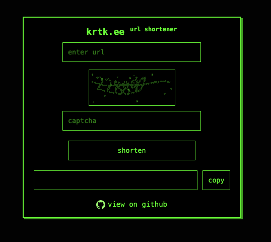

# krtk.ee - Simple URL Shortener

This project was created because I didn't see any easy-to-use or easy-to-deploy URL shorteners, so I made my own.

## Live Demo

Try it out: [https://krtk.ee/](https://krtk.ee/)

## Features

- **Shorten URLs** – Quickly generate short links.
- **CAPTCHA Protection** – Prevents automated abuse.
- **SQLite Database** – Lightweight and easy to deploy.
- **Minimalist Web UI** – Simple and functional interface.

## Screenshot

```

```

## Installation

### Prerequisites

- Go (latest version recommended)
- SQLite3

### Setup

```
git clone https://github.com/ajarmoszuk/krtk.git
cd krtk
```

Build and run:

```
go get
go build -o krtk
./krtk
```

The server runs on port `:2137` by default. Open `http://localhost:2137/` in your browser.

## API Endpoints

### Shorten a URL
```
POST /shorten
```
**Request Body:**
```
{
  "original": "https://example.com",
  "captcha_id": "captcha_id",
  "captcha": "captcha_text"
}
```
**Response:**
```
{
  "short": "/go/abc12"
}
```

### Redirect to the Original URL
```
GET /go/{short}
```

### Generate a New CAPTCHA
```
GET /captcha
```
**Response:**
```
{
  "captcha_id": "abc123"
}
```

### Retrieve a CAPTCHA Image
```
GET /captcha/{id}
```
**Response:** CAPTCHA image

## License

This project is open-source under the MIT License.